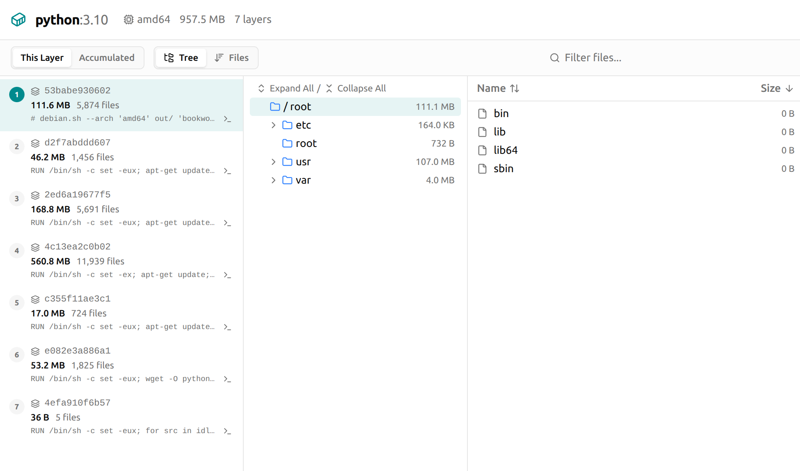
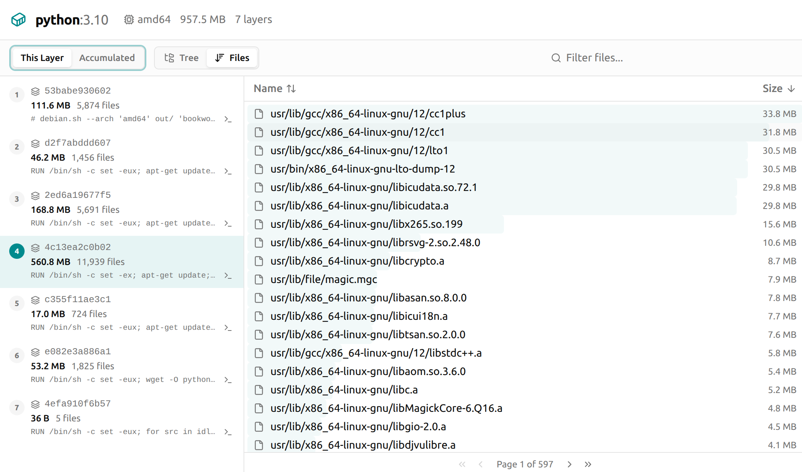

<p align="center">
  
</p>

---

Peel apart your container images — see exactly what's in each layer, find bloat, and share results as a single HTML file.

## Why

Your Docker image is 2 GB and you have no idea why. Every `RUN` instruction adds a layer, and each layer can silently pile up packages, build tools, cached downloads, or stray artifacts that have nothing to do with your application. The usual debugging loop — `docker history`, `docker save`, manually digging through tars — is tedious and tells you very little.

Peel gives you a complete, file-level breakdown of every layer in seconds. You can see exactly which Dockerfile step added 600 MB of build dependencies, find the 200 MB model file someone accidentally copied in, or discover that your multi-stage build is still dragging along the entire compiler toolchain.

- **Interactive HTML report** — tree view, file list, layer details, all in a single self-contained page. No server, no install — just open it in a browser or send it to your team.
- **Spot large files instantly** — flat file list sorted by size. One click to find the 300 MB binary buried three layers deep.
- **Blazing fast on Linux** — reads Docker's overlay2 storage directly, skipping the slow `docker save` export entirely. A 4 GB image inspects in seconds, not minutes.
- **Keyboard-friendly** — <kbd>Tab</kbd> between panels, arrow keys to navigate. No mouse required.
- **Works everywhere** — Docker, Podman, containerd. Linux, macOS. Local images or tar archives. Falls back to OCI CLI automatically when overlay2 isn't available.

## Why not dive?

[dive](https://github.com/wagoodman/dive) is the well-known tool in this space. It's a great project, but we kept hitting walls with it:

- **Unusable on large images.** Dive loads everything into a TUI. On images over 4 GB the UI freezes for minutes, navigation has multi-second delays, and on 20 GB+ images it effectively hangs ([#393](https://github.com/wagoodman/dive/issues/393), [#604](https://github.com/wagoodman/dive/issues/604)).
- **TUI truncates information.** Long `RUN` commands — the most important thing you need to read — get cut off with no way to see the full text ([#356](https://github.com/wagoodman/dive/issues/356)). No sort-by-size ([#89](https://github.com/wagoodman/dive/issues/89)). No export to JSON/CSV ([#487](https://github.com/wagoodman/dive/issues/487)).
- **Slow by design.** Dive always runs `docker save` and parses the full tar. It doesn't use overlay2 direct storage access, so even a locally-cached image takes a long time on large images.
- **Fragile with modern Docker.** Docker v25+ switched to OCI-layout archives, breaking dive's layer parsing entirely ([#507](https://github.com/wagoodman/dive/issues/507), [#534](https://github.com/wagoodman/dive/issues/534)). Enabling containerd image store also broke it ([#510](https://github.com/wagoodman/dive/issues/510)). Local images sometimes aren't found at all ([#360](https://github.com/wagoodman/dive/issues/360)).
- **Maintenance gaps.** There was a 13-month gap between v0.12.0 and v0.13.0. As of early 2026, the last release is nearly a year old ([#568](https://github.com/wagoodman/dive/issues/568)).

Peel takes a different approach: generate a self-contained HTML report instead of a TUI. This means no freezing on large images, full layer commands are always visible, you can sort/filter/search freely, and you can share the report with your team by just sending a file.

## Install

```sh
curl --proto '=https' --tlsv1.2 -LsSf https://github.com/fudanglp/peel/releases/latest/download/peel-installer.sh | sh
```

## Usage

```sh
peel <image:tag>
```

That's it. Peel auto-detects your container runtime, exports the image, and opens an interactive report in your browser.

### Options

```
peel <image>                   Inspect an image (opens HTML report)
peel <image> --no-web          Print layer summary to stdout
peel <image> --json out.json   Export full layer data as JSON
peel <image> --use-oci         Force OCI/CLI path (no root needed, slower)
peel <image> --no-sudo         Don't auto-escalate to sudo
peel <image> --runtime podman  Override runtime selection
peel image.tar                 Inspect a tar archive directly
peel probe                     List detected container runtimes
peel update                    Update peel to the latest version
```

## Screenshots

**Tree + File view** — browse the filesystem of each layer, expand directories, see sizes at a glance:



**Files view** — flat file list sorted by size, find the largest files in a layer instantly:




## Development

### Architecture

Peel has three inspection backends, all behind a common `Inspector` trait:

| Backend | How it works | Speed | Root? | Platform |
|---------|-------------|-------|-------|----------|
| **overlay2** | Reads Docker's storage directory on disk | Fastest | Yes | Linux |
| **OCI** | Calls `docker save` / `podman save` / `ctr export` | Slower | No | Cross-platform |
| **tar archive** | Parses a pre-exported `.tar` file | Medium | No | Cross-platform |

By default, peel tries **overlay2** first (auto-escalating with `sudo`) because it skips the export step entirely. If that's not available — wrong OS, wrong storage driver, or `--use-oci` flag — it falls back to the **OCI** path, which works anywhere a container runtime CLI is installed.

### Building

```sh
cargo build
cargo run -- python:3.10
```

### Releasing

Requires [just](https://github.com/casey/just) and [cargo-dist](https://opensource.axo.dev/cargo-dist/):

```sh
cargo install just cargo-dist
```

```sh
just current        # show current version
just release 0.2.0  # bump version, regenerate CI, commit, tag, push
```
